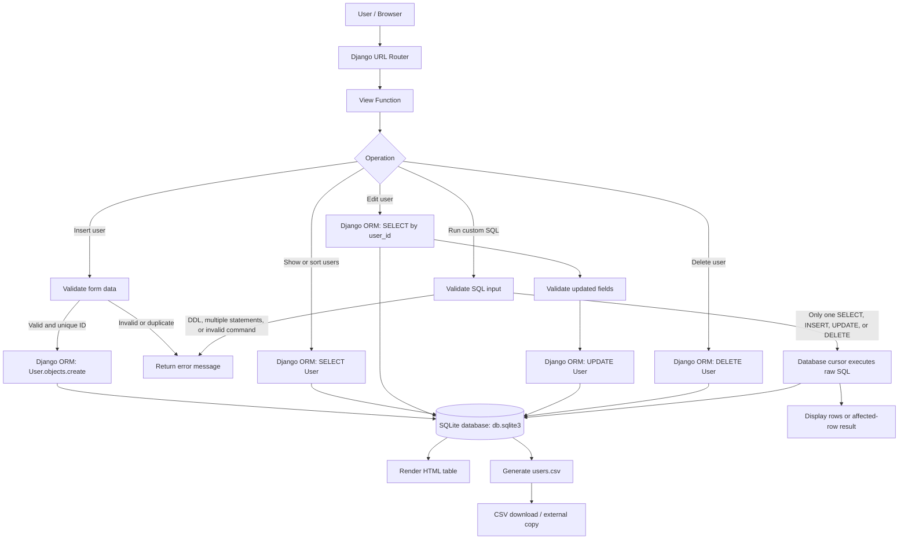
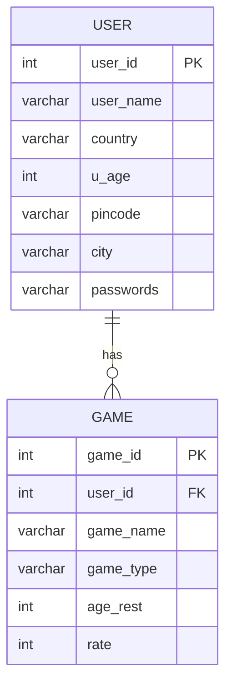
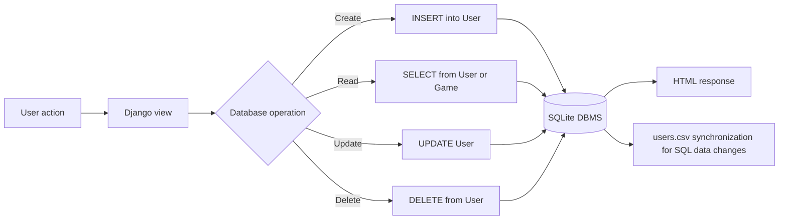
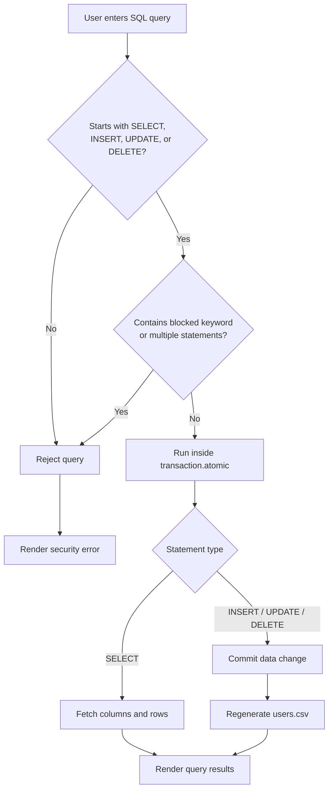

# DBMS Project Flowchart

## 1. Overall system flow

## 2. Database design / ER view

### DBMS interpretation

- `User` is the main entity and uses `user_id` as its primary key.
- `Game` uses `game_id` as its primary key and stores `user_id` to associate games with users.
- The supplied `_database.sql` declares `Game.user_id` as a foreign key referencing `User.user_id`.
- In the current Django model and migration, `Game.user_id` is an `IntegerField`, so Django does not currently enforce that relationship as a `ForeignKey`. The relationship is therefore logical in the running Django application unless the database was created from `_database.sql`.
- The database engine configured for the application is SQLite, stored in `db.sqlite3`.

## 3. CRUD and query flow

## 4. Custom SQL safety flow

## Short presentation explanation

This project is a database-driven Django web application. The browser sends a request to a Django URL, the URL selects a view, and the view performs database operations through either the Django ORM or a controlled raw SQL cursor. SQLite stores the persistent records in two main tables: `User` and `Game`. The application supports the four DBMS CRUD operations: inserting, selecting, updating, and deleting records. It also demonstrates sorting, filtering, joining `User` and `Game`, transactions, primary keys, and the intended foreign-key relationship. After data-changing SQL operations, the current `User` records are synchronized to `users.csv` for export; the CSV is a copy of the database data, not the primary database.

## Suggested title for a report

**DBMS-Based User and Game Management System Using Django and SQLite**
